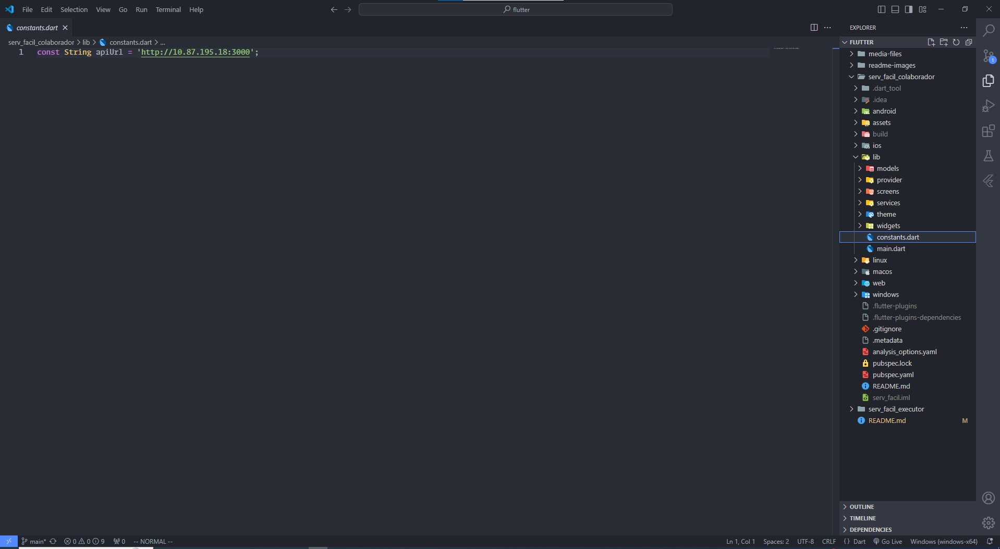

# Projeto ServiFacil - Gerenciamento de OSs (Ordens de Serviço)
O sistema ServiFacil é uma aplicação **web** e **mobile** para gerenciamento de ordens de serviço, onde o usuário pode cadastrar, editar, excluir, visualizar,adicionar comentários e concluir a execução de ordens de serviço. O sistema possui a funcionalidade de autenticação, onde o usuário pode se cadastrar e fazer login.<br>O sistema possui duas interfaces diferentes, onde o usuário pode ser um **colaborador** ou um **executor**. O colaborador pode cadastrar, editar, excluir e visualizar as ordens de serviço, enquanto o executor pode visualizar as ordens de serviço, adicionar comentários e marcar como concluída, além de visualizar o histórico de ordens de serviço concluídas e um dashboard com gráficos de desempenho<br>Esta solução pode ser aplicada em pequenas empresas de prestação de serviços, como assistência técnica, manutenção de equipamentos, instalação de sistemas, entre outros.<br>Pode ser aplicada a indústrias para gerir a manutenção de máquinas e equipamentos, a empresas de instalação de sistemas de segurança, a empresas de instalação de sistemas de energia solar, entre outros.<br>Este projeto foi desenvolvido como exemplo para o componente de **Projetos** do curso **Técnico em Desenvolvimento de Sistemas** da escola **SENAI de Jaguariúna**.

## Tecnologias

||Tecnologia|Tarefa|
|:-:|-|-|
|[](https://www.apachefriends.org/pt_br/index.html)|XAMPP|BD MySQL MariaDB
|[](https://nodejs.org/en)|**NodeJS**|API Back-End|
|[](https://www.prisma.io/)|Prisma|ORM BD MySQL|
|[](https://insomnia.rest/download)|Insomnia|Testes Unitários e de integração|
| [](https://jwt.io/)|JWT|Autenticação|
|[](https://code.visualstudio.com/)|**VsCode**|IDE Back, Front|
|[](https://developer.mozilla.org/pt-BR/docs/Web/HTML)[](https://developer.mozilla.org/pt-BR/docs/Web/CSS)[](https://developer.mozilla.org/pt-BR/docs/Web/JavaScript)|HTML, CSS, JS **Vanilla**|Front-End|
|[](https://react.dev/)|**React**|Front End|
|[](https://axios-http.com/ptbr/docs/intro)|Axios|Front End consumir API|
|[](https://flutter.dev/)|**Flutter**|Framework Mobile com linguagem Dart|
|[](https://developer.android.com/studio?hl=pt-br)|**Android Studio**|IDE Mobile para utilizar Emulador|

## Passos para a Execução da API
- 1 Clonar este repositório
- 2 Abrir com o **VsCode**
- 3 Na pasta ./api criar um arquivo **.env** contendo: 
```js
DATABASE_URL="mysql://root@localhost:3306/oss?schema=public&timezone=UTC"
KEY="base64:q3
```
- 4 Abrir XAMPP  e clicar em Start nos serviços **Mysql** e **Apache**.
- 5 Instalar as dependências e o banco de dados, no **VsCode**, abra um terminal **CTRL + '** e digite os seguintes comandos:
```bash
cd api 
npm i
npx prisma migrate dev --name init
```
- 6 Preencher o banco de dados com dados de teste, copiando os dados do arquivo **./docs/dados.sql** e colando no **phpMyAdmin** ou terminal MySQL.
```bash
mysql -u root
```
- 7 Exercutar a API
```bash
npx nodemon
```
- 8 Para testar com Insomnia, importar o arquivo **./docs/testes/Insomnia.json**.

## Execução do Front-End - Vanilla
- 1 Acessar a pasta ./vanilla e executar o arquivo **index.html** com **live server** (Extensão do VsCode) ou **Open with Live Server**.
## Execução do Front-End - React
- 1 Abrir a pasta ./react com VsCode
- 2 Abrir um **terminal** cmd ou bash e executar os comandos a seguir:
```bash
cd react
npm i
npm start
```
- **Obs**: Versão com React em desenvolvimento, poucas funcionalidades implementadas.

## Versão Mobile em flutter
- 1 Instalar o **Flutter** e o **Android Studio** com o **Emulador** ([Tutorial](https://github.com/wellifabio/cursoflutter/tree/main/aula01)).
- 2 Abrir o Android Studio, criar e abrir um **Emulador** de celular.
- 3 Escolha uma das versões do app na pasta flutter (**serv_facil_colaborador** ou **serv_facil_executor**) e abra com o Vscode.
- 4 Abra um terminal bash ou cmd e digite:
```bash
flutter pub get
```
- 5 Selecione um emulador.

- 6 Na aba de debug do vscode, clique em Run and Debug
- 7 No arquivo constant.dart dentro de /lib, edite o ip para corresponder ao do seu computador.


## Wireframe e Protótipo


- [Arquivo Figma](./docs/design/ServiFacil.fig)
- [Weireframe WEB em PDF](./docs/design/ServiFacil-WEB.pdf)
