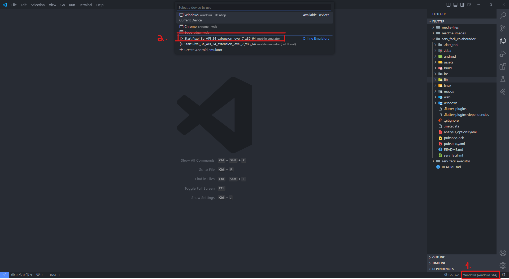
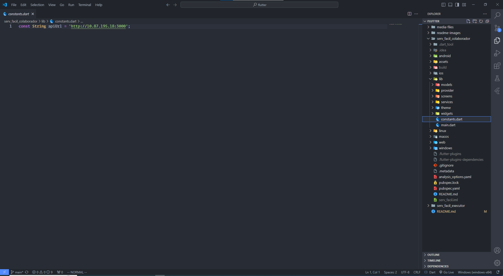

# Versão Mobile do app OS

### Passos para executar o app localmente

1. Escolha uma das versões do app e entre com o Vscode.
2. No terminal, digite:
```bash
flutter pub get
```
3. Selecione um emulador.

4. Na aba de debug do vscode, clique em Run and Debug
5. No arquivo constant.dart dentro de /lib, edite o ip para corresponder ao do seu computador.

