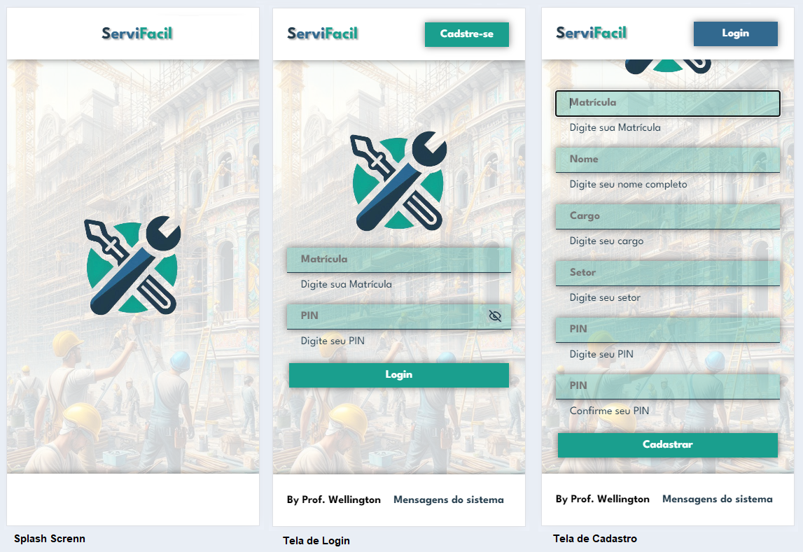
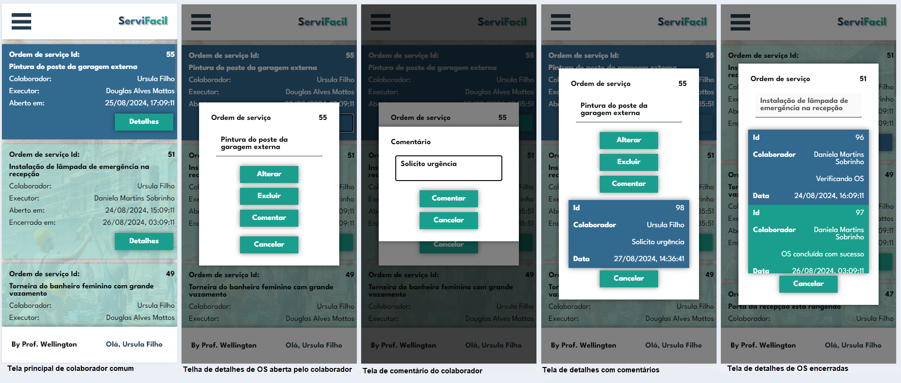
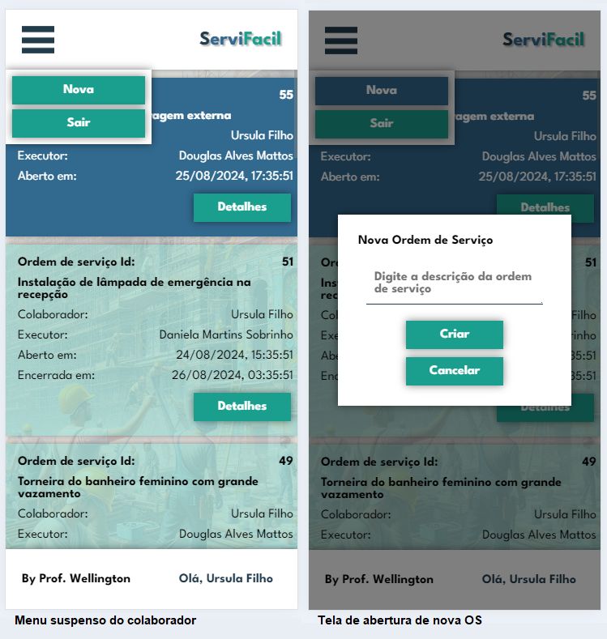

# Instruções para o desenvolvimento mobile com Flutter

As três telas iniciais a serem desenvolvidas são:
- Spash Screen - Com o efeito de aparecer do ícone do sistema
- Tela de login - Com o efeito de aparecer da esquerda para a direita dos campos do formulário e o olho para ver a senha
- Tela de cadastro - Com o efeito de aparecer da esquerda para a direita dos campos do formulário

- Tela principal de colaborador comum - Lista todas as OSs abertas por ele tanto novas como concluídas
- Tela de detalhes de OS abertas pelo colaborador - Mostra os detalhes da OS e a possibilidade de adicionar comentários, excluir, alterar e cancelar, também lista os comentários já feitos.
- Tela de comentário do colaborador - Mostra o campo de texto para adicionar comentário e a lista de comentários já feitos.
- Tela de detalhes de OS concluídas pelo colaborador - Mostra os detalhes da OS e a possibilidade apenas ver os comentários.

- Menu de opções - Com as opções de sair e abrir nova OS
- Tela de nova OS - Com o efeito de aparecer. ao registrar a nova OS deve pegar a localização do colaborador, a api já pega como padrão a data e hora do sistema.